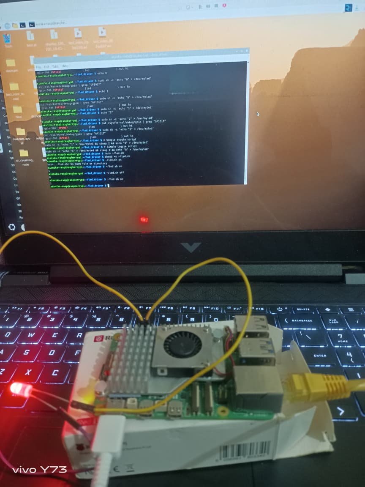
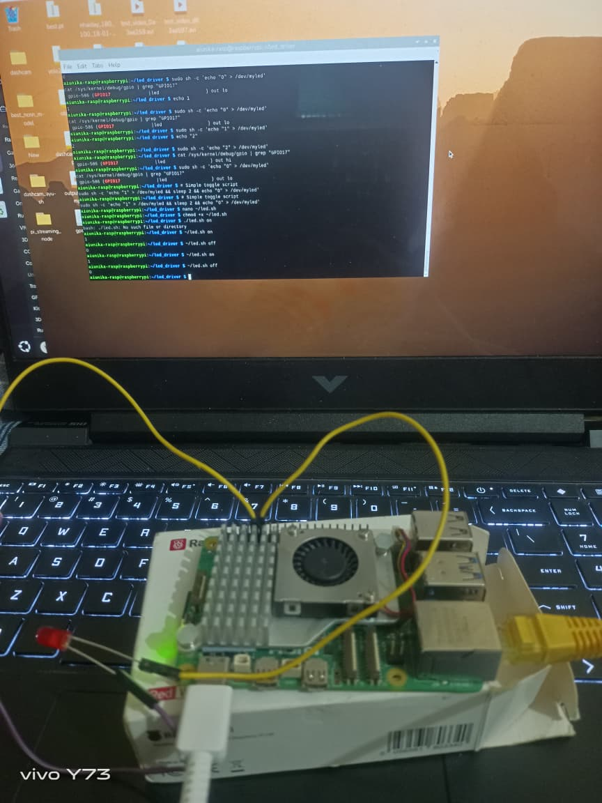
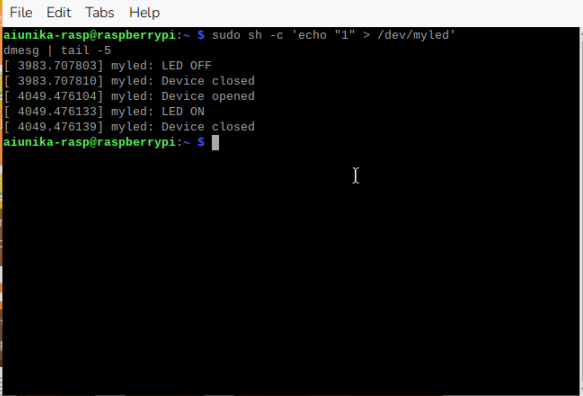
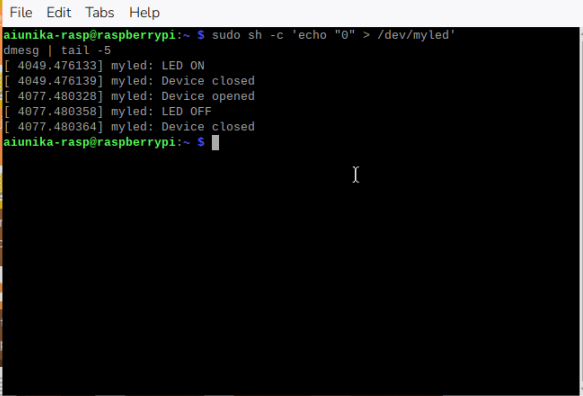
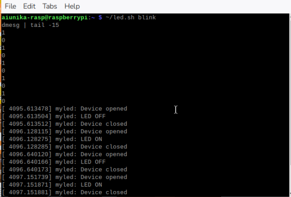
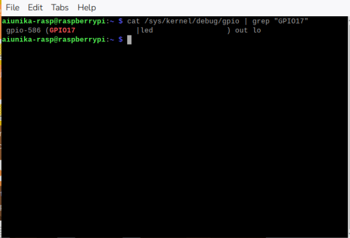

# LED Device Driver for Raspberry Pi 5 — Embedded Linux

A Linux kernel character device driver that controls an LED via GPIO 17 on Raspberry Pi 5 running kernel 6.12, built from scratch using two approaches — legacy API (educational) and modern Device Tree + gpiod API (production-grade, physically works on Pi 5).

---

## Why Two Versions?

Pi 5 uses a new **RP1 chip** as its GPIO controller. The legacy integer-based GPIO API silently fails to physically drive pins on RP1. The fix is the modern **gpiod descriptor API** with a proper **Device Tree overlay** — which is also how production Linux drivers work.

| | `led_driver.c` (v1) | `led_driver_v2.c` (v2) |
|---|---|---|
| API | Legacy `gpio_request()` | Modern `gpiod_get()` |
| Device Tree | No | Yes |
| Physically drives pin | ❌ Silent fail on Pi 5 | ✅ Works |
| Driver model | `module_init/exit` | `platform_driver` with `probe()`/`remove()` |

---

## What This Project Demonstrates

- Linux kernel module (LKM) development in C
- Character device driver with `file_operations` (open/write/release)
- Legacy vs modern GPIO API on Pi 5's RP1 chip
- Device Tree overlay for GPIO consumer binding
- Platform driver model — `probe()`/`remove()` instead of `module_init/exit`
- Kernelspace → hardware pipeline via `/dev/myled`
- `copy_from_user()` for safe userspace → kernelspace data transfer

---

## Hardware

- Raspberry Pi 5
- LED + 330Ω resistor
- GPIO 17 (Physical Pin 11)

## Wiring

```
Pi Pin 11 (GPIO17) → 330Ω resistor → LED(+) long leg
Pi Pin 9  (GND)    →                  LED(-) short leg
```

See [docs/wiring.md](docs/wiring.md) for full details.

---

## Demo

| LED ON | LED OFF |
|---|---|
|  |  |

### Terminal Output





### GPIO Pin Status (physically driven HIGH)



```
gpio-586 (GPIO17 | led) out hi   ← pin actually driven by kernel
```

---

## Project Structure

```
led-kernel-driver-rpi5/
├── driver/
│   ├── led_driver.c       # v1 — legacy API (educational)
│   ├── led_driver_v2.c    # v2 — Device Tree + gpiod (Pi 5 working)
│   ├── led-overlay.dts    # Device Tree overlay (required for v2)
│   └── Makefile
├── test/
│   └── test_led.c         # Userspace C test program
├── docs/
│   └── wiring.md
├── images/                # Demo photos and terminal screenshots
└── README.md
```

---

## How to Build & Run

### v2 — Recommended (physically works on Pi 5)

```bash
# Install dependencies
sudo apt install linux-headers-$(uname -r) build-essential device-tree-compiler

# Compile driver
cd driver
make

# Compile and load Device Tree overlay
dtc -@ -I dts -O dtb -o led.dtbo led-overlay.dts
sudo dtoverlay led.dtbo

# Load driver
sudo insmod led_driver_v2.ko

# Control LED
sudo sh -c 'echo "1" > /dev/myled'   # LED ON
sudo sh -c 'echo "0" > /dev/myled'   # LED OFF

# Unload
sudo rmmod led_driver_v2
sudo dtoverlay -r led
```

### v1 — Legacy (educational, compiles but does not physically drive pin on Pi 5)

```bash
cd driver
make
sudo insmod led_driver.ko
echo "1" | sudo tee /dev/myled
sudo rmmod led_driver
```

---

## Kernel Log Output (v2)

```
[ 999.626468] myled: probe() called - DT node matched!
[ 999.626687] myled: Driver initialized, /dev/myled created
[1019.648893] myled: Device opened
[1019.648918] myled: LED ON
[1019.648925] myled: Device closed
```

---

## Key Concepts Learned

| Concept | Description |
|---|---|
| `insmod` / `rmmod` | Load and unload kernel modules |
| `file_operations` | Maps syscalls to driver functions |
| `copy_from_user()` | Safe userspace → kernelspace data transfer |
| `platform_driver` | Modern driver binding via Device Tree |
| `gpiod_get()` | Modern GPIO descriptor API |
| `probe()` / `remove()` | Called automatically on device match/removal |
| Device Tree overlay | Declares hardware to the kernel without hardcoding |
| `dmesg` | Kernel log for debugging driver output |

---

## Environment

- **Board:** Raspberry Pi 5
- **OS:** Raspberry Pi OS (Debian Trixie)
- **Kernel:** 6.12.62+rpt-rpi-2712
- **Architecture:** aarch64
  
